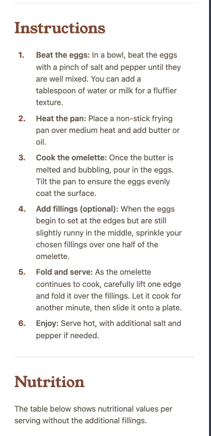

# Frontend Mentor - Recipe page solution

This is a solution to the [Recipe page challenge on Frontend Mentor](https://www.frontendmentor.io/challenges/recipe-page-KiTsR8QQKm). Frontend Mentor challenges help you improve your coding skills by building realistic projects.

## Table of contents

- [Overview](#overview)
  - [The challenge](#the-challenge)
  - [Screenshot](#screenshot)
  - [Links](#links)
- [My process](#my-process)
  - [Built with](#built-with)
  - [What I learned](#what-i-learned)
- [Author](#author)

## Overview

### Screenshot

##### Desktop


##### Mobile




### Links

- Live Site URL: [Demo](https://petrihcour.github.io/recipe-page/)

## My process

### Built with

- Semantic HTML5 markup
- CSS custom properties
- Mobile-first workflow
- [Tailwind CSS](https://tailwindcss.com/) - CSS Framework

### What I learned

I had the challenge of customizing a list's bullet points and numbers - having them be separate colors. After a lot of digging, I learned how to apply custom CSS stylings to them, overriding Tailwind CSS' default properties for lists.

```html
<div class="bg-rose-50 p-8 rounded-lg">
  <h5 class="font-outfit-600 text-rose-800 text-xl pb-2">Preparation time</h5>
  <ul class="custom-list-disc-rose font-outfit-400 text-stone-600">
    <li class="pb-2">
      <div class="px-3">
        <span class="font-outfit-600">Total:</span> Approximately 10 minutes
      </div>
    </li>
    <li class="pb-2">
      <div class="px-3">
        <span class="font-outfit-600">Preparation:</span> 5 minutes
      </div>
    </li>
    <li>
      <div class="px-3">
        <span class="font-outfit-600">Cooking:</span> 5 minutes
      </div>
    </li>
  </ul>
</div>
```

```css
.custom-list-disc-chestnut {
  list-style-type: none;
  padding-left: 0.5rem;
}

.custom-list-disc-chestnut li {
  position: relative;
  padding-left: 1.5rem;
}

.custom-list-disc-chestnut li::before {
  content: "•";
  position: absolute;
  left: 0;
  color: #854632;
}
```

## Author

- Website - [Vanessa Garcia](https://vanessagarcia.netlify.app/)
- Frontend Mentor - [@petrihcour](https://www.frontendmentor.io/profile/petrihcour)